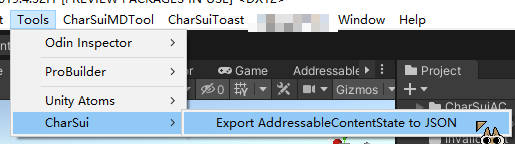

# CharConfig
> This en readme use DeepSeek-V3 to translate

[Chinese](README.md)
[English](README-EN.md)

# Overview
Unity's Addressable Asset System is excellent for standalone games. However, when you need to use it for hot-updating (hot-fixing) live online games, you may find that some of its logic is poorly documented, and certain features can be abstract or unintuitive.

Common pain points include:

Addressable settings can break after certain version upgrades.

The UI interface sometimes fails to adapt correctly.

After using AddressablesContentState.bin to check for resource updates, more dependent resources than expected might be flagged for "update," even when they are already built locally (and listed as local in the catalog).

This tool is designed to address one specific aspect of these challenges by providing better visibility into the update process.

# Purpose
This tool exports the addressablesContentState file (the manifest used by Addressables to compare resource changes) into a human-readable JSON format.

Primary Use Case: Compare the current state with a previous AddressablesContentState file using external diff tools like WinMerge to analyze exactly what has changed between builds.

# Features
Simple one-click operation from the Unity Editor.

Exports the binary AddressablesContentState data into a structured JSON file.

Facilitates detailed comparison and analysis of resource changes between different builds.

# Usage
  
In the Unity Editor, navigate to the top menu: Tools -> CharSui -> Export AddressableContentState to JSON.

A file dialog will appear. Select the source AddressablesContentState.bin file you wish to convert.

Another dialog will appear. Choose the destination folder and filename for the exported JSON file.

The tool will process the file and save the JSON output to your specified location. You can then open this JSON file in any text editor or diff tool.